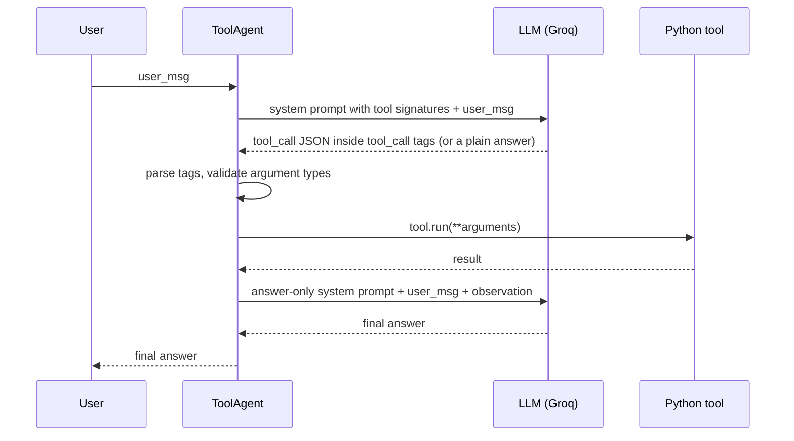
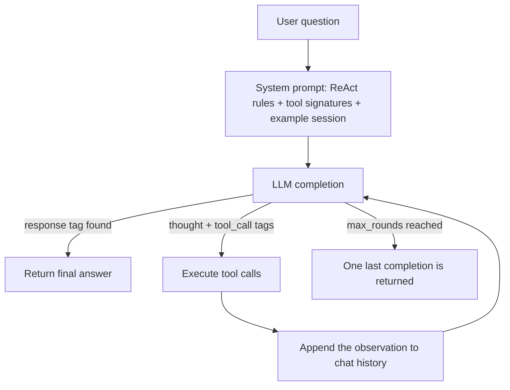

# Agentic Patterns from Scratch

Build LLM agents **without any agent framework**: just Python, the [Groq](https://groq.com) chat-completions API and a few well-structured prompts.

This repository implements two foundational agentic design patterns:

| # | Pattern | Script | What it demonstrates |
|---|---------|--------|----------------------|
| 1 | **Tool Use** | [`agent_part1/agent01.py`](agent_part1/agent01.py) | The LLM decides when to call a Python function (the live Hacker News API) and uses the result to answer. |
| 2 | **ReAct** (Reason + Act) | [`agent_part1/agent02.py`](agent_part1/agent02.py) | The LLM loops *Thought → Action → Observation*, chaining several tool calls to solve a multi-step problem. |

Both agents share a small toolkit, [`agent_pattern_utils.py`](agent_part1/agent_pattern_utils.py), that turns any type-annotated Python function into an LLM-callable tool with a single `@tool` decorator.

---

## Table of contents

- [Key ideas](#key-ideas)
- [Repository structure](#repository-structure)
- [How it works](#how-it-works)
- [Code description](#code-description)
- [How to run](#how-to-run)
- [Sample output](#sample-output)
- [Build your own tools](#build-your-own-tools)
- [Configuration reference](#configuration-reference)
- [Changes from the reference implementation](#changes-from-the-reference-implementation)
- [Troubleshooting](#troubleshooting)
- [Limitations](#limitations)
- [Roadmap](#roadmap)
- [License](#license)
- [Acknowledgements](#acknowledgements)

---

## Key ideas

- **Tools are described in the prompt.** Each tool's JSON signature (name, docstring, parameter types) is placed inside `<tools></tools>` tags in the system prompt.
- **The model answers with XML tags.** It replies with `<tool_call>`, `<thought>` and `<response>` blocks that are parsed with a regular expression. No native function-calling API is needed, so the approach works with any chat model that follows instructions.
- **Arguments are validated before execution.** Values chosen by the model are cast to the types declared in the function's annotations (for example `"5"` → `5`) before the tool runs.
- **Observations are fed back.** Tool results go back to the model as *observations*, so it can produce a grounded final answer or decide on the next action. A failed tool call becomes an `Error: ...` observation instead of crashing the agent.

---

## Repository structure

```
agentic-patterns-from-scratch/
├── agent_part1/
│   ├── agent_pattern_utils.py   # Shared helpers: prompts, chat history, @tool decorator, tool execution, tag parsing
│   ├── agent01.py               # Pattern 1: Tool Use agent (Hacker News tool)
│   └── agent02.py               # Pattern 2: ReAct agent (arithmetic / logarithm tools)
├── .env.example                 # Template for your Groq API key (copy to .env)
├── .gitignore
├── LICENSE
├── requirements.txt
└── README.md
```

---

## How it works

### 1. Tool Use agent (`agent01.py`)



1. The agent sends the user's message along with a system prompt listing every tool signature.
2. If the model decides a tool is needed, it replies with one or more `<tool_call>{"name": ..., "arguments": ..., "id": ...}</tool_call>` blocks.
3. Each call is parsed, its arguments are type-checked, and the matching Python function is executed.
4. A second LLM call writes the final, grounded answer. It receives the original question and the tool results (the *observation*), under a short system prompt that asks for a plain-text answer with no further tool calls. If no tool was needed, it simply answers the question.

### 2. ReAct agent (`agent02.py`)



The ReAct agent keeps a running chat history and repeats up to `max_rounds` (default 10) times:

1. **Thought**: the model reasons about what to do next (`<thought>...</thought>`).
2. **Action**: it calls one or more tools (`<tool_call>...</tool_call>`).
3. **Observation**: the agent runs the tools and appends the results as `<observation>...</observation>`. If a call fails (for example the model names a tool that doesn't exist), the error is appended instead, and the model can correct itself in the next round.
4. When the model has enough information, it replies with `<response>...</response>`, which ends the loop.

For the demo question *"sum 1234 and 5678, multiply by 5, then take the logarithm"*, the model chains **three** tools: `sum_two_elements` → `multiply_two_elements` → `compute_log`.

---

## Code description

### `agent_pattern_utils.py`: shared building blocks

| Name | Kind | Purpose |
|------|------|---------|
| `DEFAULT_MODEL`, `resolve_model(model)` | constant, function | Chooses the model: an explicit argument, else the `GROQ_MODEL` env var, else `openai/gpt-oss-120b`. |
| `completions_create(client, messages, model, max_retries=2)` | function | Calls the Groq chat-completions endpoint and returns the text. Retries when the model returns an empty message or Groq rejects the reply with `tool_use_failed`. |
| `build_prompt_structure(prompt, role, tag="")` | function | Builds a `{"role": ..., "content": ...}` message, optionally wrapping the content in `<tag></tag>`. |
| `update_chat_history(history, msg, role)` | function | Appends a new message to a chat history. |
| `ChatHistory` | class (`list`) | Chat history with an optional maximum length. Drops the oldest message when full. |
| `FixedFirstChatHistory` | class | Like `ChatHistory`, but always keeps the first (system) message. |
| `validate_arguments(tool_call, tool_signature)` | function | Casts model-supplied arguments to the annotated `int`, `str`, `bool` or `float` type. The strings `"true"`/`"false"` become booleans, and other annotation types are passed through unchanged. Argument names the tool doesn't have raise an error. |
| `run_tool_calls(tool_calls_content, tools_dict)` | function | Parses each `<tool_call>` JSON, validates the arguments, runs the tool and returns `{call_id: result}`. Invalid JSON, an unknown tool, bad arguments or an exception inside the tool becomes an `"Error: ..."` result instead of crashing the agent. |
| `Tool` | class | Wraps a function with its name and JSON signature. `run(**kwargs)` executes it. |
| `get_fn_signature(fn)` | function | Builds the tool schema from the function's name, docstring and type annotations. |
| `@tool` | decorator | Turns a plain function into a `Tool` instance. |
| `extract_tag_content(text, tag)` → `TagContentResult` | function, dataclass | Extracts every `<tag>...</tag>` block from a model response (`content: list[str]`, `found: bool`). |
| `fancy_print`, `fancy_step_tracker` | functions | Coloured console banners (kept for the upcoming part 2 patterns). |

For example, the `@tool` decorator turns `fetch_top_hacker_news_stories` into this signature, which is what the model sees:

```json
{
  "name": "fetch_top_hacker_news_stories",
  "description": "Fetch the titles and URLs of the current top `top_n` stories on Hacker News.",
  "parameters": {"properties": {"top_n": {"type": "int"}}}
}
```

### `agent01.py`: Tool Use agent

| Member | Description |
|--------|-------------|
| `ToolAgent(tools, model=None)` | Creates a Groq client and registers one tool or a list of tools. |
| `TOOL_SYSTEM_PROMPT` | Instructs the model to emit `<tool_call>` JSON for any function it wants to use. |
| `add_tool_signatures()` | Concatenates all tool signatures to fill the `<tools></tools>` block. |
| `process_tool_calls(tool_calls_content)` | Executes the parsed tool calls with `run_tool_calls` and returns `{call_id: result}`. |
| `run(user_msg)` | First LLM call decides on tool usage. Tools are executed. Second LLM call writes the final answer from the observation. |
| `fetch_top_hacker_news_stories(top_n: int)` | Tool that queries the [Hacker News Firebase API](https://github.com/HackerNews/API) and returns a JSON list of `{title, url}`. Network errors are returned as `{"error": ...}`. |

Running the script asks two questions: one that needs no tool (*"Tell me your name"*) and one that does (*"Tell me the top 5 Hacker News stories right now"*).

### `agent02.py`: ReAct agent

| Member | Description |
|--------|-------------|
| `ReactAgent(tools, model=None, system_prompt="")` | Creates the agent. `system_prompt` is an optional persona or backstory placed before the ReAct instructions. |
| `REACT_SYSTEM_PROMPT` | Explains the Thought → Action → Observation loop, the tag format and an example session. |
| `process_tool_calls(tool_calls_content)` | Same as in `ToolAgent`: executes the calls with `run_tool_calls` and collects the observations. |
| `run(user_msg, max_rounds=10)` | Runs the ReAct loop until a `<response>` tag appears or `max_rounds` is reached. |
| `sum_two_elements(a: int, b: int)` | Tool: returns `a + b`. |
| `multiply_two_elements(a: int, b: int)` | Tool: returns `a * b`. |
| `compute_log(x: int)` | Tool: natural logarithm of `x`, with a friendly message for `x <= 0`. |

---

## How to run

### Prerequisites

- **Python 3.10+** (tested on Python 3.12 and 3.13)
- A free **Groq API key** from <https://console.groq.com/keys>
- Internet access (for the Groq API; `agent01.py` also calls the public Hacker News API)

### 1. Clone the repository

```bash
git clone https://github.com/VinayakMokashi/agentic-patterns-from-scratch.git
cd agentic-patterns-from-scratch
```

### 2. Create and activate a virtual environment

**Windows (PowerShell)**

```powershell
python -m venv .venv
.venv\Scripts\Activate.ps1
```

**macOS / Linux**

```bash
python3 -m venv .venv
source .venv/bin/activate
```

### 3. Install the dependencies

```bash
pip install -r requirements.txt
```

### 4. Add your Groq API key

Copy the template and paste your key into it:

```bash
# macOS / Linux
cp .env.example .env
```

```powershell
# Windows
copy .env.example .env
```

```dotenv
GROQ_API_KEY=your_groq_api_key_here
```

`load_dotenv()` searches for a `.env` file starting from the script's folder and moving up, so a `.env` at the repository root is found automatically.

### 5. Run the agents

```bash
cd agent_part1

# Pattern 1: Tool Use agent
python agent01.py

# Pattern 2: ReAct agent
python agent02.py
```

You can also run them from the repository root, for example `python agent_part1/agent01.py`.

**Colour legend in the console:** green = tool usage, magenta = the model's thought, blue = observations, yellow = final answer, red = a failed tool call.

### Optional: use a different model

Set `GROQ_MODEL` in your `.env`:

```dotenv
GROQ_MODEL=openai/gpt-oss-120b
```

or pass it in code: `ToolAgent(tools=[...], model="...")` / `ReactAgent(tools=[...], model="...")`.
The available models are listed at <https://console.groq.com/docs/models>.

---

## Sample output

Real runs with `openai/gpt-oss-120b`. LLM answers vary from run to run.

<details>
<summary><b>agent02.py (ReAct agent)</b></summary>

```text
Thought: I need to calculate the sum of 1234 and 5678.
Using Tool: sum_two_elements
Tool call dict:
{'name': 'sum_two_elements', 'arguments': {'a': 1234, 'b': 5678}, 'id': 0}
Tool result:
6912
Observations: {0: 6912}

Thought: Now I need to multiply the sum (6912) by 5.
Using Tool: multiply_two_elements
Tool call dict:
{'name': 'multiply_two_elements', 'arguments': {'a': 6912, 'b': 5}, 'id': 1}
Tool result:
34560
Observations: {1: 34560}

Thought: Now I need to compute the natural logarithm of 34560.
Using Tool: compute_log
Tool call dict:
{'name': 'compute_log', 'arguments': {'x': 34560}, 'id': 2}
Tool result:
10.450452222917992
Observations: {2: 10.450452222917992}

Final answer:
The final result is approximately 10.450452222917992.
```

</details>

<details>
<summary><b>agent01.py (Tool Use agent)</b></summary>

```text
Response 1:
I'm ChatGPT, an AI language model created by OpenAI.

Using Tool: fetch_top_hacker_news_stories
Tool call dict:
{'name': 'fetch_top_hacker_news_stories', 'arguments': {'top_n': 5}, 'id': 1}
Tool result:
[{"title": "Shopify is moving from React Native back to Swift and Kotlin", "url": "https://shopify.engineering/back-to-native"}, {"title": "More questions about whether researchers can trust OpenAI with unpublished math", "url": "https://mathstodon.xyz/@andreasthom/117240535270608201"}, ...]

Response 2:
Here are the current top 5 stories on Hacker News (as of the latest fetch):

| Rank | Title | Link |
|------|-------|------|
| 1 | **Shopify is moving from React Native back to Swift and Kotlin** | https://shopify.engineering/back-to-native |
| 2 | **More questions about whether researchers can trust OpenAI with unpublished math** | https://mathstodon.xyz/@andreasthom/117240535270608201 |
| 3 | **The Deathray: A simple way for an untrusted site to freeze a Mac** | https://auberon.xyz/blog/posts/deathray/ |
| 4 | **OpenAI Agents API** | https://developers.openai.com/api/docs/guides/agents-api/overview |
| 5 | **Cognition launches new SWE-2 model, Rivaling Fable 5.1 and GPT-Astra** | https://cognition.com/blog/swe-2 |
```

The stories change constantly, so your list will be different. The tool result above is truncated.

</details>

---

## Build your own tools

Any function with **type-annotated parameters** and a **docstring** can become a tool. The docstring is sent to the model as the tool's description. Run the following from inside `agent_part1/`:

```python
from agent01 import ToolAgent
from agent_pattern_utils import tool

@tool
def get_word_length(word: str) -> int:
    """Return the number of characters in a word."""
    return len(word)

agent = ToolAgent(tools=[get_word_length])
print(agent.run("How many letters are in the word 'agentic'?"))
```

Combine several tools and give the ReAct agent a persona:

```python
from agent02 import ReactAgent, sum_two_elements, multiply_two_elements

agent = ReactAgent(
    tools=[sum_two_elements, multiply_two_elements],
    system_prompt="You are a meticulous maths tutor.",
)
print(agent.run("What is (12 + 30) * 3?"))
```

Tips:

- Prefer `int`, `str`, `bool` or `float` annotations. These are the types `validate_arguments` casts. Other types (such as `list`) work, but the value is passed to the tool exactly as the model sent it.
- Return a string or a JSON-serialisable value so the observation reads well in the prompt.
- Keep the docstring short and specific. It is the model's only description of the tool.

---

## Configuration reference

| Setting | Where | Default | Description |
|---------|-------|---------|-------------|
| `GROQ_API_KEY` | `.env` or environment variable | *(required)* | Your Groq API key. |
| `GROQ_MODEL` | `.env` or environment variable | `openai/gpt-oss-120b` | Model used when no `model` argument is passed. |
| `model` | `ToolAgent(...)`, `ReactAgent(...)` | `None` → `resolve_model()` | Per-agent model override. |
| `system_prompt` | `ReactAgent(...)` | `""` | Persona or backstory placed before the ReAct instructions. |
| `max_rounds` | `ReactAgent.run(...)` | `10` | Maximum Thought → Action → Observation iterations. |
| `max_retries` | `completions_create(...)` | `2` | Extra attempts when the model returns an empty message or a `tool_use_failed` error. |

---

## Changes from the reference implementation

The first commits in this repository contain the reference implementation as it was originally written. The commits that follow fix problems found while testing it:

1. **Decommissioned model.** `llama-3.3-70b-versatile` no longer exists on Groq (`404 model_not_found`). The default is now `openai/gpt-oss-120b`, and you can override it with `GROQ_MODEL`.
2. **Unreliable replies from reasoning models.** `completions_create` now retries when the model returns an empty message. It also retries when Groq rejects a reply with `tool_use_failed` because the model tried to use its own built-in tools.
3. **`agent01.py`**
   - `openai/gpt-oss-120b` often wrote the `<tool_call>` block inside its hidden reasoning and left the visible reply empty, so the tool never ran. The tool prompt now asks for the tags in the reply text and forbids native function calling.
   - The observation message had a stray nested f-string, so the model received the literal text `f"Observation: ..."`. The message now also lists the tool calls that produced the results, so the model knows where the data came from.
   - The final-answer call now has a short system message. It says that observations are real tool results, and that the answer must be plain text with no tool calls. Without it, the model sometimes claimed it "cannot access live data" or tried to browse on its own.
   - The demo now prints both responses. Previously it printed nothing.
   - HTTP requests have a timeout, and network errors are returned to the model as JSON.
4. **`agent02.py`**
   - It crashed with `IndexError` when the model called a tool without a `<thought>` tag.
   - Calling `run()` twice on the same agent appended the ReAct prompt to the system prompt again each time.
   - Observations are now wrapped in `<observation>` tags, as the system prompt describes.
   - The demo now prints the final answer.
5. **Tool docstrings added.** They become the tool descriptions the model reads.
6. **Robust tool execution.** A single bad tool call used to crash either agent. This happened with malformed JSON, an unknown tool name, a missing `id`, an unexpected argument or an uncastable value. Both agents now share `run_tool_calls`, which turns these failures into `Error: ...` observations. `validate_arguments` also no longer treats the string `"false"` as `True`, and no longer crashes on tools with `list` or `dict` parameters.
7. **Unicode-safe console output.** Printing an answer that contained characters such as a narrow no-break space (common in `gpt-oss` output) crashed with `UnicodeEncodeError` when output was redirected or piped on Windows. Characters the console can't encode are now replaced instead.

---

## Troubleshooting

| Symptom | Likely cause | Fix |
|---------|--------------|-----|
| `401 ... invalid_api_key` / `expired_api_key` | The key is missing, wrong or expired. | Create a new key and put it in `.env`. A `GROQ_API_KEY` already set in your shell takes precedence over `.env`, and `load_dotenv()` uses the **first** `.env` it finds walking up from the script. |
| `404 model_not_found` | The model was decommissioned. | Set `GROQ_MODEL` to a model listed at <https://console.groq.com/docs/models>. |
| `400 tool_use_failed: Tool choice is none, but model called a tool` | The model tried native function calling, or its own built-in tools, instead of the XML tag format. `openai/gpt-oss-20b` does this consistently. | `completions_create` already retries this twice. If it persists, use `openai/gpt-oss-120b` (the default). |
| `429 rate_limit_exceeded` | You hit the free-tier token or request limits. | Wait a minute or switch to a model with higher limits. |
| `ModuleNotFoundError: agent_pattern_utils` | You imported the agents from another folder. | Run the scripts by path (`python agent_part1/agent01.py`) or from inside `agent_part1/`. |
| Red `Tool call failed: Error: ...` lines | The model produced an invalid tool call. | Usually harmless: `ReactAgent` sees the error and tries again. If it happens constantly, check your tool's name, parameters and docstring. |
| The final answer ignores the tool result | LLM output is non-deterministic. | Re-run the script, or use `ReactAgent`, which checks observations inside its loop. |

---

## Limitations

- `ToolAgent` performs a single round of tool calls. If a call fails, the model can only report the error. For multi-step problems, or to retry failed calls, use `ReactAgent`.
- Parsing depends on the model following the XML-tag format, and small models may not comply reliably.
- Only `int`, `str`, `bool` and `float` arguments are type-cast. Other types are passed to the tool as the model sent them.

---

## Roadmap

- **Part 2** (coming soon): the **Reflection** pattern (a generate → critique → revise loop) and a **multi-agent crew** with dependency-ordered execution.

---

## License

Released under the [MIT License](LICENSE). Portions of the code are derived from The Neural Maze's [agentic-patterns-course](https://github.com/neural-maze/agentic-patterns-course), Copyright (c) 2024 The Neural Maze, also under the MIT License.

---

## Acknowledgements

- The code structure follows The Neural Maze's [agentic-patterns-course](https://github.com/neural-maze/agentic-patterns-course), which implements the four agentic design patterns (Reflection, Tool Use, Planning and Multi-agent) from scratch.
- Hacker News data comes from the official [Hacker News API](https://github.com/HackerNews/API).
- LLM inference is provided by [Groq](https://groq.com).
